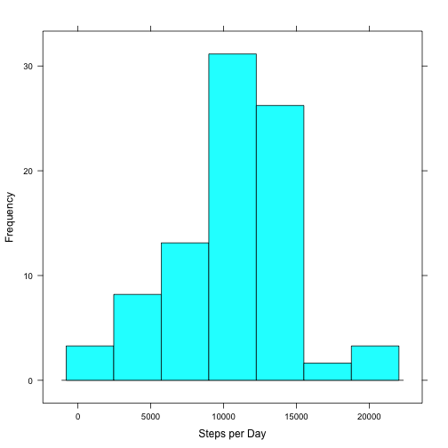
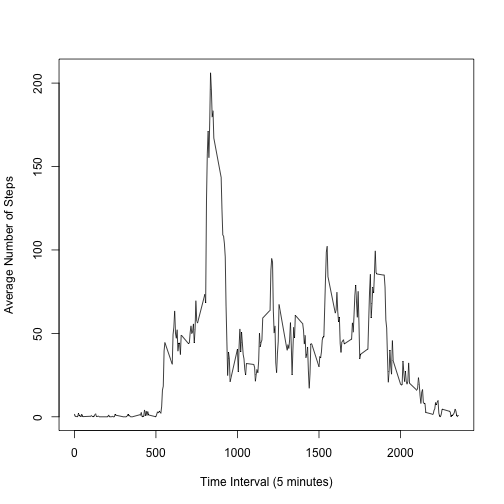
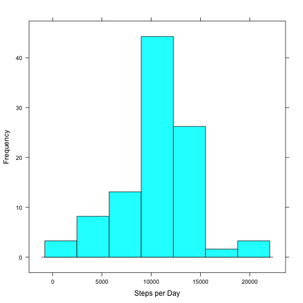
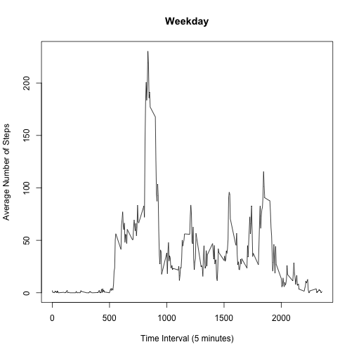
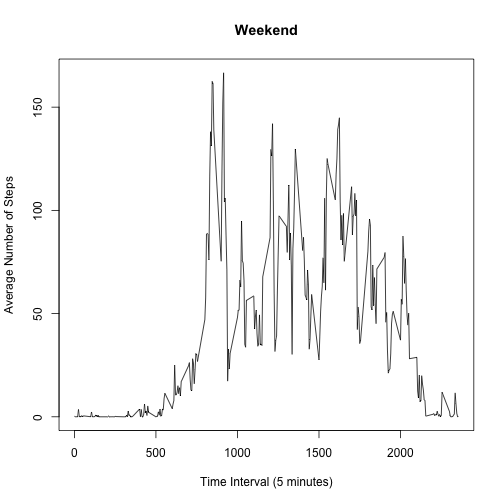

=====================================

Read in data file, calculate total number of steps per day, and provide summary statistics (including mean and median).


```r
data <- read.csv("activity.csv")
steps_total <- tapply(data$steps, data$date, sum)
mean(steps_total, na.rm = TRUE)
```

```
## [1] 10766.19
```

```r
median(steps_total, na.rm = TRUE)
```

```
## [1] 10765
```

###Histogram of steps per day

 

=================================

Calculate the average steps per 5 minute interval across each of the days. Which time interval has the maximum number of average steps? 


```r
ave_steps_by_int <- tapply(data$steps, data$interval, mean, na.rm = TRUE)
names(which.max(ave_steps_by_int))
```

```
## [1] "835"
```

###Line graph of the average number of steps per 5 minute time interval versus the time of day (0 hours -> 2400 hours)

 

===============================

Determine the number of missing values in the dataset


```r
sum(is.na(data))
```

```
## [1] 2304
```

Replace the missing values in the dataset with the average number of steps for that 5 minute interval and compare the re-calculated mean/median with those obtained earlier. 


```r
data_edit <- replace(data$steps, is.na(data$steps), ave_steps_by_int)
data_edit_intermediate <- as.data.frame(data_edit)
data_edit2 <- cbind(data_edit_intermediate, data[,2:3])
steps_total2 <- tapply(data_edit2[,1], data$date, sum)
mean(steps_total2)
```

```
## [1] 10766.19
```

```r
median(steps_total2)
```

```
## [1] 10766.19
```

The mean is identical with/without the missing values, whereas the median is slightly higher with the missing values replaced.

###Histogram of steps per day with missing values replaced with average number of steps for that particular time interval

 

================================

Using the modified dataset, determine days of the week that each date in the dataset correpsonds to, and introduce variable to the dataset indicating whether it's a weekend or a weekday. Determine the average steps per 5 minute interval on weekends versus weekdays.

```r
date_conv <- as.Date(data[,2])
day <- weekdays(date_conv, abbreviate = FALSE)
First <- gsub("Monday", "Weekday", day)
Second <- gsub("Tuesday", "Weekday", First)
Third <- gsub("Wednesday", "Weekday", Second)
Fourth <- gsub("Thursday", "Weekday", Third)
Fifth <- gsub("Friday", "Weekday", Fourth)
Sixth <- gsub("Saturday", "Weekend", Fifth)
DayType <- gsub("Sunday", "Weekend", Sixth)
Data_DayType <- cbind(data_edit2, DayType)
colnames(Data_DayType)[1] <- "steps"
Wkdy_data <- Data_DayType[Data_DayType$DayType == "Weekday",]
Wknd_data <- Data_DayType[Data_DayType$DayType == "Weekend",]
ave_steps_by_int_Wkdy <- tapply(Wkdy_data$steps, Wkdy_data$interval, mean)
ave_steps_by_int_Wknd <- tapply(Wknd_data$steps, Wknd_data$interval, mean)
```
###Line graphs of the average number of steps per 5 minute time interval versus the time of day (0 hours -> 2400 hours) on Weekdays versus Weekends
  
